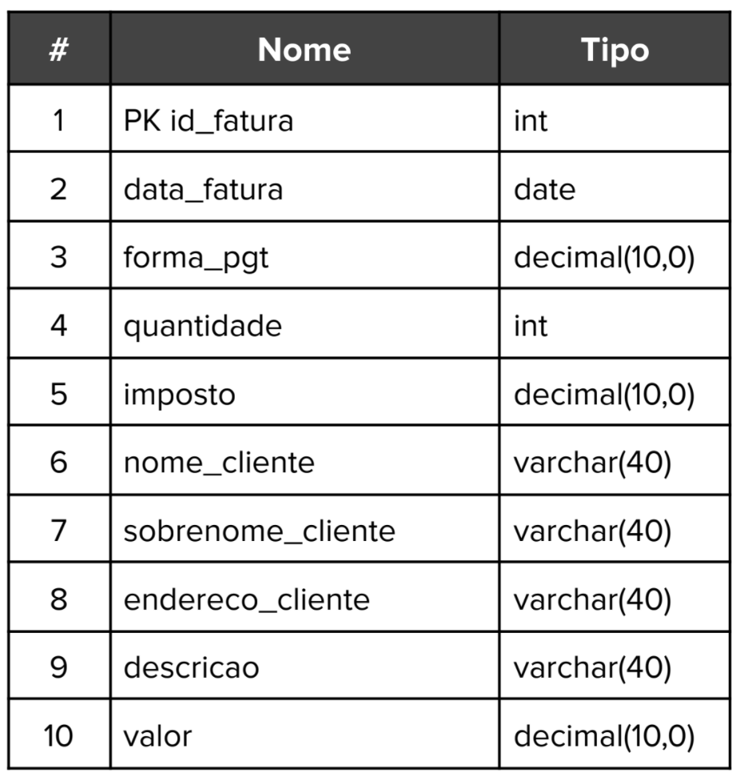
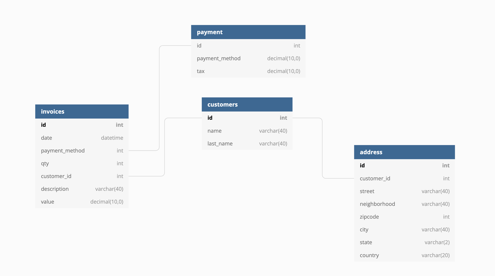

# Normalização 

## Tabela a ser normalizada

Para a normalização da tabela apresentada, foram aplicados os níveis de normalização apresentados.

Primeiramente, foi extraído o campo de endereço que poderia incluir diversas informações em um único campo, criando uma tabela externa para os endereços

Referente ao nível de normalização 2, foram extraídos todas as informacoes de cliente que nao dependiam da chave primária da fatura, separando-os em uma segunda
tabela, realizando uma referencia por meio do id na tabela de faturas.

Segundamente foi aplicado o conceito definido na terceira forma normal, em que extraímos o subgrupo 
de forma de pagamento para uma tabela externa, em que inclui a taxa e  a forma em sí, 
também realizando uma referencia por meio do id.

