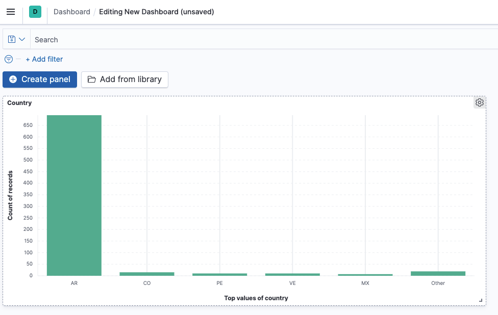
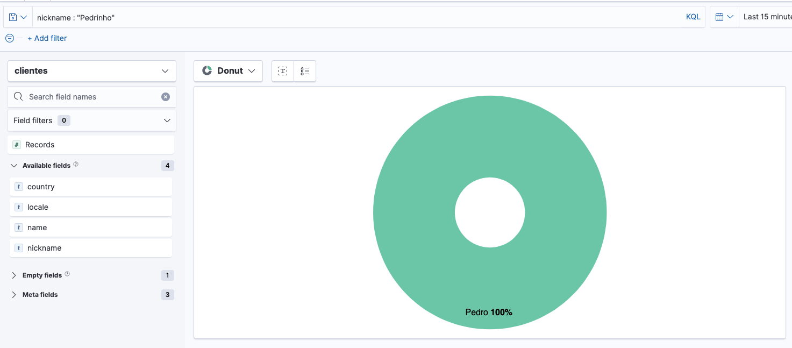

### Dashboard example - Person per country




### Insert data

```
POST /clientes/_doc
{
  "name": "Pedro",
  "nickname": "Pedrinho",
  "country": "Brazil",
  "locale": "Jundiaí"
}
```

### Find data
```
GET /clientes/_search
{
  "query": {
    "match": {
      "country": "Brazil"
    }
  }
}
```

### Dashboard example - filter by nickname

